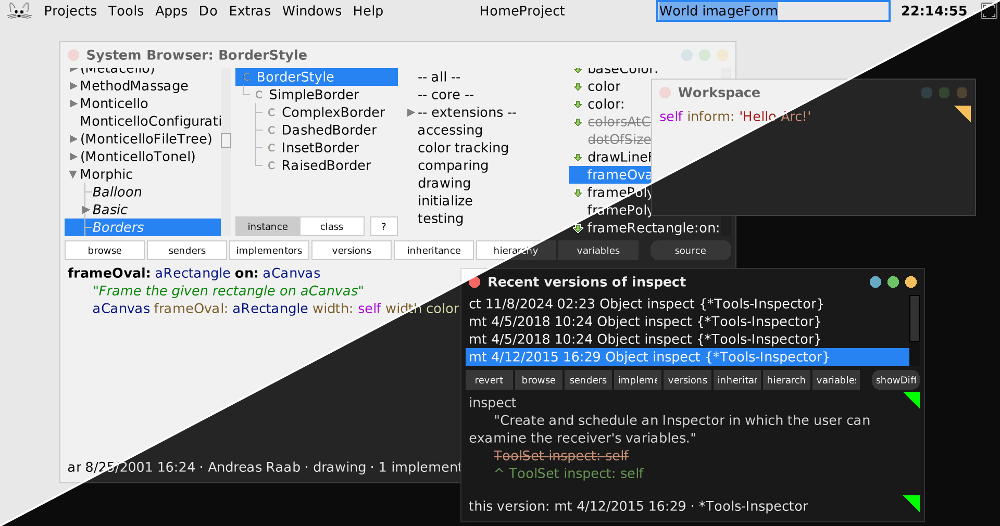
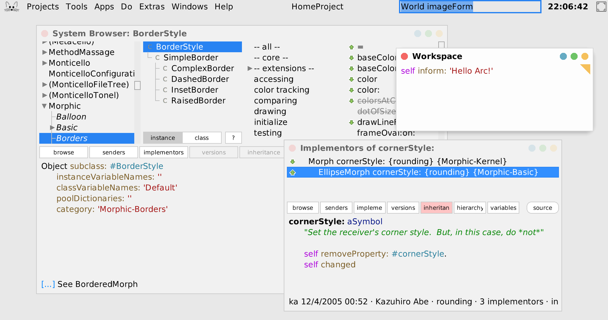
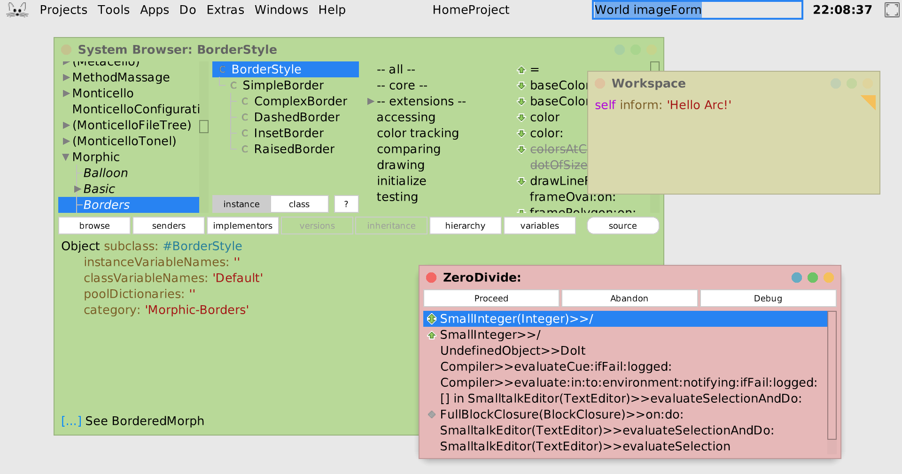
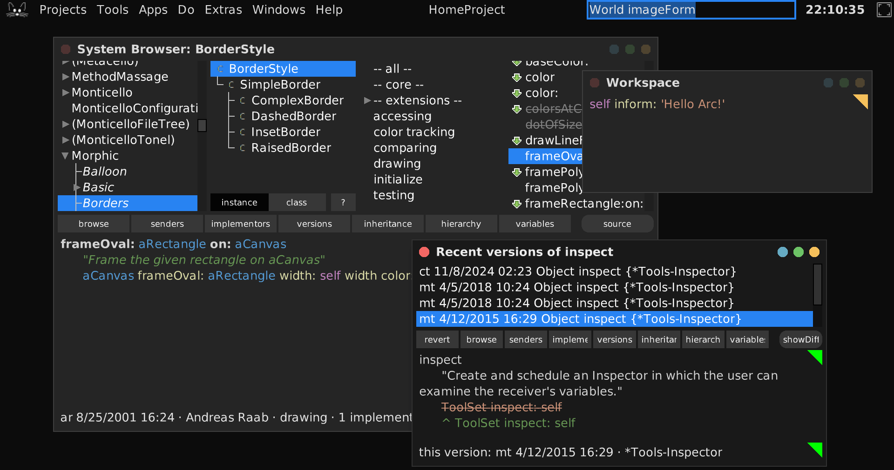
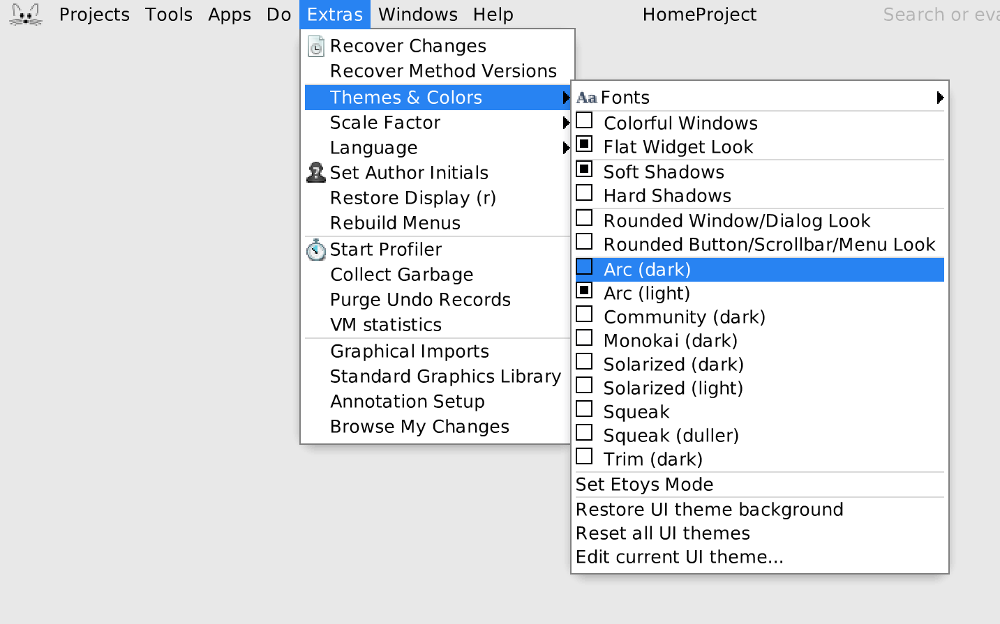

# Squeak Arc Theme

New minimalistic UI theme for Squeak, designed by Tom Beckmann ([@tom95](https://github.com/tom95)). Experimental.

<picture>
 <source media="(prefers-color-scheme: light)" srcset="./screenshots/combined-alt.png">
 <source media="(prefers-color-scheme: dark)" srcset="./screenshots/combined.png">
 
</picture>
<table width="100%">
	<tr>
		<th width="33.33%">Light</th>
		<th width="33.33%">Light (Colorful)</th>
		<th width="33.33%">Dark</th>
	</tr>
	<tr>
		<td><a href="./screenshots/light.png"></a></td>
		<td><a href="./screenshots/light-colorful.png"></a></td>
		<td><a href="./screenshots/dark.png"></a></td>
	</tr>
</table>

## Installation

```smalltalk
Metacello new
	baseline: 'ArcTheme';
	repository: 'github://hpi-swa-lab/sq-arc-theme/src';
    get;
	load.
```

Then choose `Arc (dark)` or `Arc (light)` from `Extras > Themes & Colors` in the world main docking bar.
You may also want to try different scale factors and the `Colorful Windows` preference.


